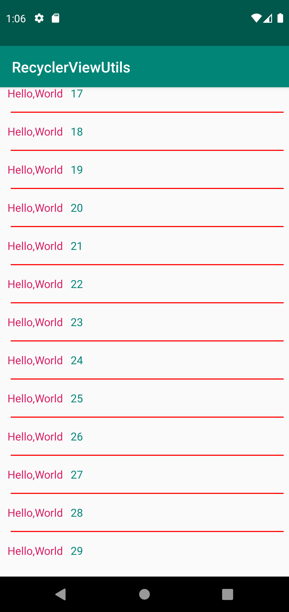
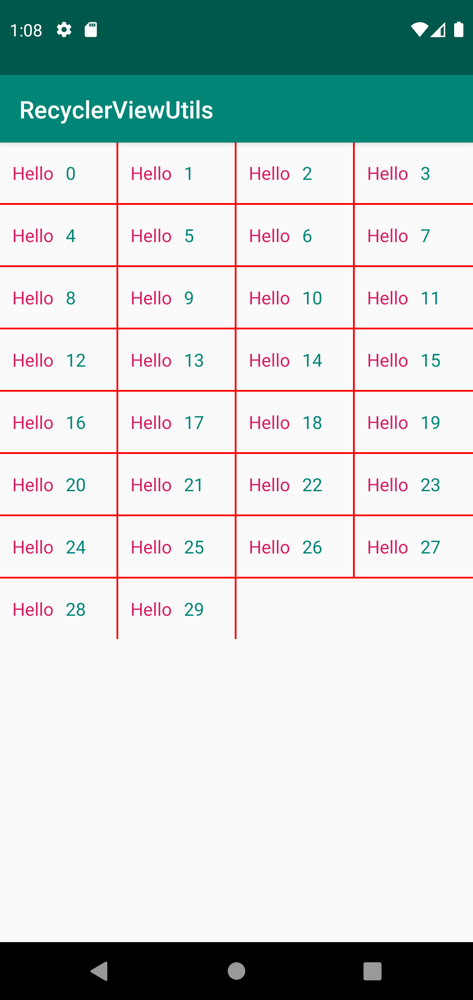

## Add Dependency

1. Project build.gradle file.
   
   ```groovy
	...
	allprojects {
    	repositories {
        	google()
        	jcenter()
        	maven { url "https://www.jitpack.io" }
    	}
	}
	...
   ```
   
2. Module build.gradle file.

	```groovy
	...
	dependencies {
    	...
    	implementation 'com.github.Tans5:tAdapter:0.7.2'
    	...
	}
	...
	```

## Create RecyclerView Adapters

First you need to create a `AdapterSpec`, then invoke `toAdapter()` method to create a Adapter.

### Create A Simple Adapter

```Kotlin

binding.myAppsRv.adapter = SimpleAdapterSpec<Pair<AppInfo, Boolean>, AppItemLayoutBinding>(
				// RecyclerView item layout resource.
                layoutId = R.layout.app_item_layout,
                // A RxJava Stream to update the data.
                dataUpdater = Observable.just(emptylist()),
                // Bind data to every items layout.
                bindData = { _, data, lBinding -> ... },
                // Data item differ check.
                differHandler = DifferHandler(itemsTheSame = { d1, d2 -> ... },
                        contentTheSame = { d1, d2 -> ... },
                        changePayLoad = { d1, d2 -> ... }),
                // Handle bind data payload.
                bindDataPayload = { _, (_, isSelect), lBinding, payloads ->
                	// if bind payload data.
                    if (...) {
                    	// TODO: bind payload data.
                        ...
                        true
                    } else {
                        false
                    }
                },
                // Set items clicks' handler. 
                itemClicks = listOf { binding, _ ->
                	// Set click view and handler (here is set item root view as click view)
                    binding.root to { _, data ->
                    	// Need a Rx Stream (Single<Unit>) to handle click.
                        Single.fromCallable { 
            				// TODO: handle clicks.
                            ...
           				}
                    }
                }
        ).toAdapter()

```

### Combine Multi AdapterSpecs

```Kotlin

binding.fileFolderRv.adapter = (SimpleAdapterSpec<DirectoryFileLeaf, FolderItemLayoutBinding>(
                layoutId = R.layout.folder_item_layout,
                ...
        ) + SimpleAdapterSpec<Pair<CommonFileLeaf, Boolean>, FileItemLayoutBinding>(
                layoutId = R.layout.file_item_layout,
                ...
        )).toAdapter()

```


### Create Adapter With EmptyView

```Kotlin

binding.serversRv.adapter = SimpleAdapterSpec<RemoteDevice, RemoteServerItemLayoutBinding>(
                                        layoutId = R.layout.remote_server_item_layout,
                                        ...
                                    )
                                        .emptyView<RemoteDevice, RemoteServerItemLayoutBinding, RemoteServerEmptyItemLayoutBinding>(
                                            emptyLayout = R.layout.remote_server_empty_item_layout,
                                            initShowEmpty = true
                                        )
                                        .toAdapter()

```

### Create Adapter With Error View

```Kotlin

binding.serversRv.adapter = SimpleAdapterSpec<RemoteDevice, RemoteServerItemLayoutBinding>(
                                        layoutId = R.layout.remote_server_item_layout,
                                        ...
                                    )
                                        .errorView<RemoteDevice, RemoteServerItemLayoutBinding, ErrorLayoutBinding>(
                                            // Error layout resource
                                            errorLayout = R.layout.error_layout,
                                            // Error checker
                                            errorChecker = Observable.just(Throwable("Test Error")),
                                            // Bind error data
                                            bindDataError = { _, error, binding -> ... }
                                        )
                                        .toAdapter()

```

## Add RecyclerView Item Divider


### Add Horizontal Divider

```Kotlin

hello_rv.addItemDecoration(
            MarginDividerItemDecoration.Companion.Builder()
                .divider(divider = MarginDividerItemDecoration.Companion.ColorDivider(
                    color = Color.RED,
                    // Divider Height, Unit: px
                    size = 4
                )
                )
                // Controll divider show (here is hide last item divider).
                .dividerController(ignoreLastDividerController)
                // Margin Start, Unit: px
                .marginStart(40)
                // Maring End, Unit: px
                .marginEnd(20)
                .build()
        )

```




### Add Horizontal and Vertical Divider

```Kotlin

grid_hello_rv.apply {
            layoutManager = GridLayoutManager(this@GridActivity, 4)
            // Add horizontal divider.
            addItemDecoration(
                MarginDividerItemDecoration.Companion.Builder()
                    .divider(
                        MarginDividerItemDecoration.Companion.ColorDivider(
                            color = Color.RED,
                            size = 4
                        )
                    )
                    .dividerDirection(MarginDividerItemDecoration.Companion.DividerDirection.Horizontal)
                    // Hide last line divider.
                    .dividerController(IgnoreGridLastLineHorizontalDividerController(4))
                    .build()
            )
            // Add vertical divider.
            addItemDecoration(
                MarginDividerItemDecoration.Companion.Builder()
                    .divider(
                        MarginDividerItemDecoration.Companion.ColorDivider(
                            color = Color.RED,
                            size = 4
                        )
                    )
                    .dividerDirection(MarginDividerItemDecoration.Companion.DividerDirection.Vertical)
                    // Hide every line last item divider.
                    .dividerController(IgnoreGridLastRowVerticalDividerController(4))
                    .build()
            )

        }

```

